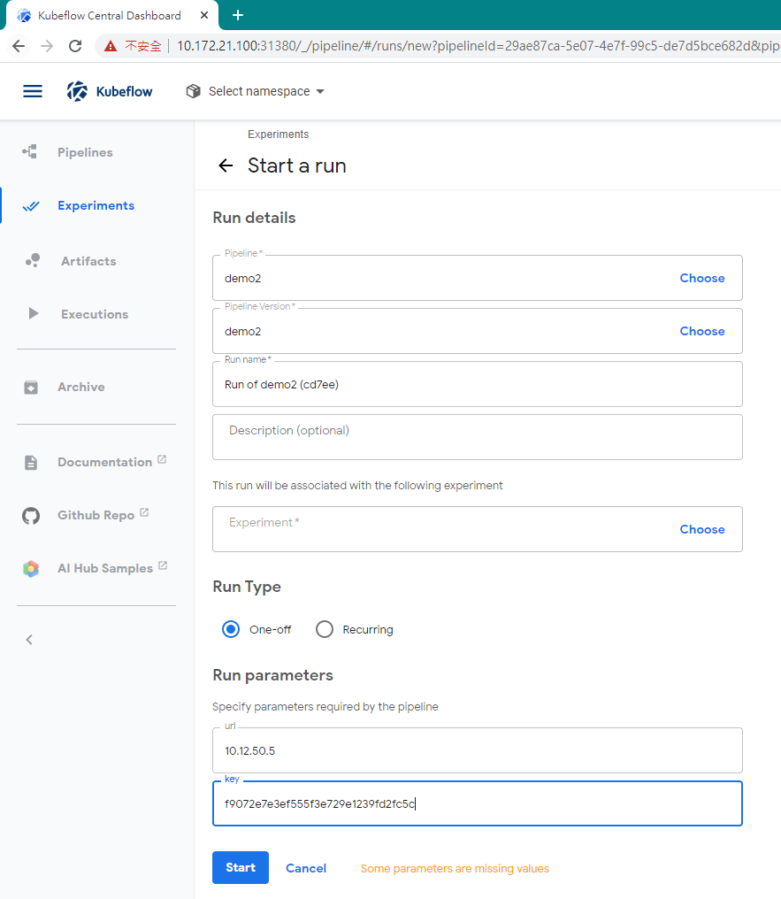

Inference sample: tensorflow-serving_sidecar
============================================

# Server deployment via kubeflow & ITRIX-Edge

1. [Install a remote kubeflow instance](https://www.kubeflow.org/docs/started/getting-started/)
2. Add trigger action in Kubeflow Pipeline
3. Start a pipeline run with the deployment key

## Add trigger action in Kubeflow Pipeline

In the original Kubeflow Pipeline, add a component for the deployment trigger.
Below is the sample pipeline, with only contain the deployment trigger.

```=python
#!/usr/bin/env python3

import kfp
from kfp import dsl

def deployed_model_op(url, key):
    return dsl.ContainerOp(
        name='Deployed - Model',
        image='google/cloud-sdk:279.0.0',
        command=['sh', '-c'],
        arguments=['curl -X GET -k -v http://$0:9000/v1/key/$1 | tee $2', url, key, '/tmp/results.txt'],
        file_outputs={
            'data': '/tmp/results.txt',
        }
    )

def echo2_op(text1):
    return dsl.ContainerOp(
        name='echo',
        image='library/bash:4.4.23',
        command=['sh', '-c'],
        arguments=['echo "Text 1: $0"', text1]
    )


@dsl.pipeline(
  name='Deployed pipeline',
  description='Trigger edge cluster to get model and prints the concatenated result.'
)
def download_and_join(
    url='',
    key='',
):

    deployed_task = deployed_model_op(url, key)

    echo_task = echo2_op(deployed_task.output)

if __name__ == '__main__':
    kfp.compiler.Compiler().compile(download_and_join, __file__ + '.yaml')
```
## Start a pipeline run with the deployment key

Select the kubeflow feature `start a run` inside the kubeflow experimenets with custom pipeline, fill in the edge URL and deployment registeration key, than press the **start** button.
 


If the edge cluster has completed all requirements described in the [Deployment Example](deployment-example.md) document, ones the pipeline completed to run, users can check the edge cluster has a new deployment.

# Client access

## Fetch the project

```=shell
# At the one of the edge compute node, or external node if cluster `Services` and external router has properly setup.
$ git clone https://github.com/fpaupier/tensorflow-serving_sidecar.git
$ cd tensorflow-serving_sidecar
```
程式client.py透過Tersorflow_Serving_IP提供服務的API，輸入一張測試圖片image1.jpg，並得到預測結果out_image2.json和out_image2.jpg。
Label文件參考https://github.com/fpaupier/tensorflow-serving_sidecar/blob/master/data/labels.pbtxt
```
python3 client.py --server_url "http://<tersorflow_serving_IP>:30005/v1/models/faster_rcnn_resnet:predict" --image_path "./object_detection/test_images/image1.jpg" --output_json "./object_detection/test_images/out_image2.json" --save_output_image "TRUE" --label_map "./data/labels.pbtxt"
```

> Note: 
> 
> 1. If python raises about missing libraries:
> ```=shell
> $ sudo su
> $ apt-get install python3-pip
> $ pip3 install --upgrade setuptools
> $ pip3 install --upgrade pip
> $ pip3 install numpy
> $ pip3 install matplotlib
> $ sudo apt install protobuf-compiler
> $ protoc your/path/to/object_detection/protos/string_int_label_map.proto --python_out=.
> ```
> 
> 2. Install tensorflow on Jetson Nano:
> ```
> $ sudo pip3 install --pre --extra-index-url https://developer.download.nvidia.com/compute/redist/jp/v43 tensorflow==1.15.2+nv20.2
> ```
