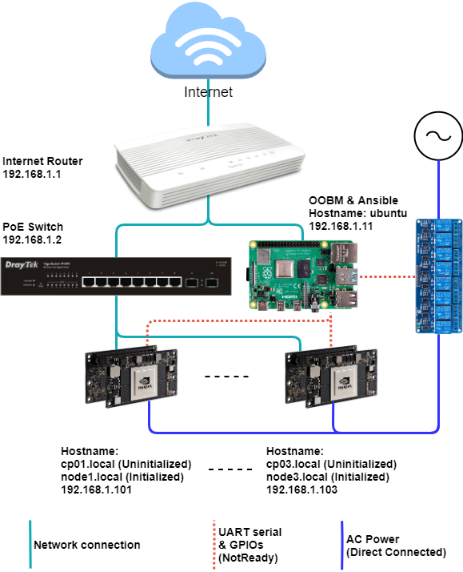

ITRIX-Edge Installation
=======================

## Platform prerequisite

### Hardware setup

To set up a local edge cluster, we need at least 4 compute nodes, and connect all nodes to the same LAN. An external router for internet access and set up each compute node as a static IP address are also required.

The reference cluster configuration described as below, OOBM, and external power control lane hardware are optional. Please follow [specification document](specification.md) for abstract instruction. 



### Cluster setting

| Node Type           | Hostname                                                | IP Address                    | 
| ------------------- | ------------------------------------------------------- | ----------------------------- | 
| Core Router         | -                                                       | 192.168.1.1                   |
| PoE Switch          | -                                                       | 192.168.1.2                   | 
| Ansible Host & OOBM | OOBM                                                    | 192.168.1.11                  | 
| Compute Node        | CP01~CPxx(Uninitialized) <br> node1~nodexx(initialized) | 192.168.1.101 ~ 192.168.1.1xx |

> **Note:** All compute node and OOBM has mDNS enabled after ITRIX-edge configurated, use `[hostname].local` for quick access.

### Compute node requirement
Each compute node should at least complete setup describe as following :
1. Ubuntu OS installation
2. Graphics driver
3. Docker container runtime
3. Wired ethernet connection and static IP address. A wireless connection is not recommended.
4. Privileged account across all compute nodes (use `root` directly is ok but not recommended. Use user account which has `sudo` privilege is an excellent alternative way)

### Ansible host requirement
The ansible host used to provide ITRIX-Edge installation.
1. Ubuntu OS installation
2. Wired ethernet connection and static IP address. A wireless connection is not recommended.
3. Ansible installed
4. ssh keyless login between ansible host and all compute nodes 

> If the cluster configuration does not contain a dedicated ansible host node, users can choose one of the compute nodes as ansible host node.


### Custom Linux kernel

For the default L4T platform ubuntu distribution, some additional kernel modules should enable in the cluster installation. Recompile kernel by enabling those modules are required. Used kernel config can be download below.

Please follow the document [Building the NVIDIA Kernel](https://docs.nvidia.com/jetson/l4t/index.html#page/Tegra%2520Linux%2520Driver%2520Package%2520Development%2520Guide%2Fkernel_custom.html%23wwpID0E0FD0HA) for rebuild kernel instructions.

* [Kernel config for TX2/Xavier to enable docker extensions & Kubernetes](https://gist.github.com/stevennick/71ba2c71bc43ad665e1aab93d6cc6372)

## Software setup

1. Download software from git
	```=shell
	# On Ansible-host
	 
	$ git clone https://github.com/itrix-edge/ITRIX-Edge.git
	$ cd ITRIX-Edge
	$ git checkout v0.1.1
	$ git submodule update --init
	```

2. Execute pre-setup for cluster prerequisite
	```=shell
	# On Ansible-host
	$ cd ITRIX-Edge/pre-setup
	$ cp inventory.sample inventory # Copy sample cluster compute node configuration
    $ vim inventory                 # Edit compute node configuration
	```
	Edit IP address for each compute nodes in file `inventory`:
	```=ini
    [CP]
	192.168.1.101
	192.168.1.102
	192.168.1.103
	192.168.1.104
	
	[OOBM]
	```
	After updated the inventory file, execute ansible-playbook to apply cluster prerequisite:
	```=shell
	# On Ansible-host
	$ ansible-playbook -i inventory playbook.yml
	```

	> **Note #1**: We can check ansible node access status by using the `ping` ansible module as following command:
	> ```=shell
	> # On Ansible-host
	> $ ansible -i inventory CP -m ping
	> ``` 
	> **Note #2**: If cluster user is configurated without directly `root` access, be remember add command options `-b -K` for each ansible commands. You will be notice to enter sudo password for compute node root access.

3. Install Kubernetes
	```=shell
	# On Ansible-host
	$ cd ../kubespray
	$ ansible-playbook -i inventory/edge cluster.yml
	```

4. Install matallb
	```=shell
	# On Ansible-host
	$ cd ../metallb/manifests
	$ ../kubespray/inventory/edge/artifacts/kubectl --kubeconfig=../kubespray/inventory/edge/artifacts/admin.conf apply -f namespace.yaml
	$ ../kubespray/inventory/edge/artifacts/kubectl --kubeconfig=../kubespray/inventory/edge/artifacts/admin.conf apply -f current-config.yaml
	$ ../kubespray/inventory/edge/artifacts/kubectl --kubeconfig=../kubespray/inventory/edge/artifacts/admin.conf apply -f metallb.yaml
	$ ../kubespray/inventory/edge/artifacts/kubectl --kubeconfig=../kubespray/inventory/edge/artifacts/admin.conf create secret generic -n metallb-system memberlist --from-literal=secretkey="$(openssl rand -base64 128)"
	```

5. Install external PosgreSQL container
	```=shell
	# On compute node #3
	$ docker run -it --name postgresql-local -p 192.168.1.103:5432:5432/tcp -e POSTGRES_PASSWORD=postgres -e POSTGRES_USER=postgres -e POSTGRES_DB=postgresdb -d postgres:11.8
	```
6. Install edge-client-agent
	```=shell
	$ cd ../edge-client-agent
	$ cat <<EOF >> external-IP.yml
	kind: Service
	apiVersion: v1
	metadata:
	  name: postgres-external
	spec:
	  ports:
	  - protocol: TCP
	    port: 5432
	    targetPort: 5432
	---
	kind: Endpoints
	apiVersion: v1
	metadata:
	  name: postgres-external
	subsets:
	  - addresses:
	      - ip: 192.168.1.103
	    ports:
	      - port: 5432
	EOF
	$ ../kubespray/inventory/edge/artifacts/kubectl --kubeconfig=../kubespray/inventory/edge/artifacts/admin.conf apply -f external-IP.yml
	$ ../kubespray/inventory/edge/artifacts/kubectl --kubeconfig=../kubespray/inventory/edge/artifacts/admin.conf apply -f edge-agent-all.yaml
	```
7. Enable edge-client-agent initialization
	```=shell
	# On Ansible-host
	$ export AGENT_IP=`./kubespray/inventory/edge/artifacts/kubectl --kubeconfig=./kubespray/inventory/edge/artifacts/admin.conf ge t svc -n edge-client-agent edge-agent -o go-template='{{.spec.clusterIP}}'`
	$ curl "http://$AGENT_IP:9000/v1/migrate/hook"
	{"result":true}
	$ curl "http://$AGENT_IP:9000/v1/migrate/deploymentTemplate"
	{"result":true}
	```

## Check status
```=shell
# On Ansible-host
$ ./kubespray/inventory/edge/artifacts/kubectl --kubeconfig=./kubespray/inventory/edge/artifacts/admin.conf get node
NAME    STATUS   ROLES    AGE   VERSION
node1   Ready    master   79m   v1.16.6
node2   Ready    master   78m   v1.16.6
node3   Ready    master   78m   v1.16.6
node4   Ready    <none>   76m   v1.16.6
...

$ ./kubespray/inventory/edge/artifacts/kubectl --kubeconfig=./kubespray/inventory/edge/artifacts/admin.conf get po -n  edge-client-agent
NAME                         READY   STATUS    RESTARTS   AGE
edge-agent-955f8bb48-wb7lc   1/1     Running   0          79m
```
 