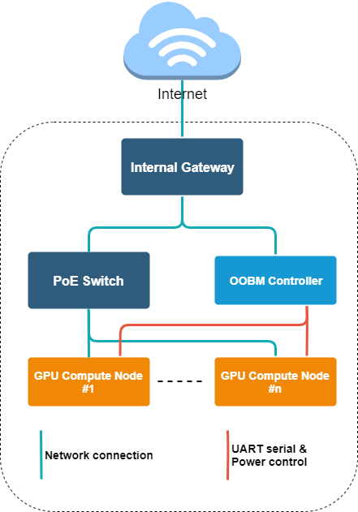
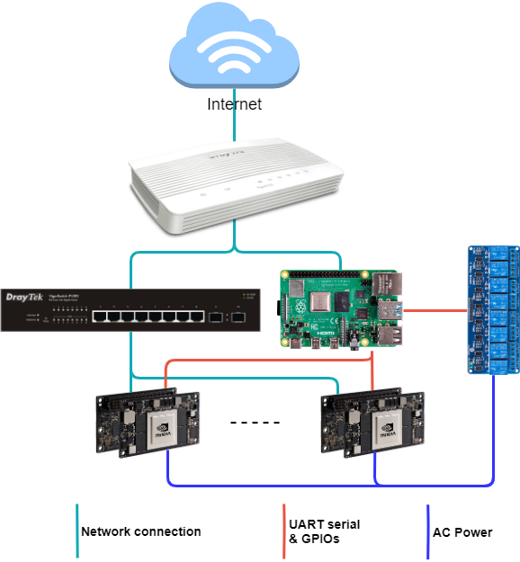
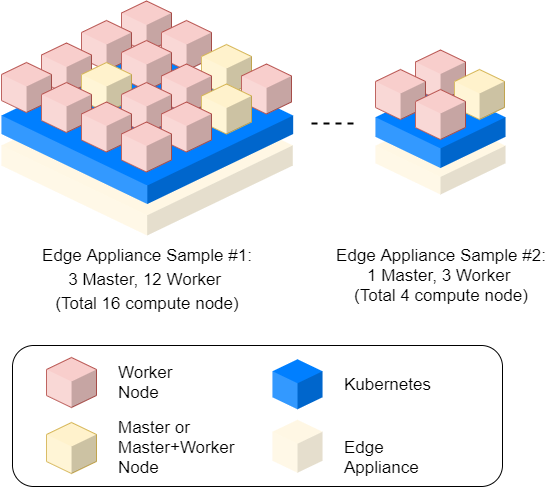
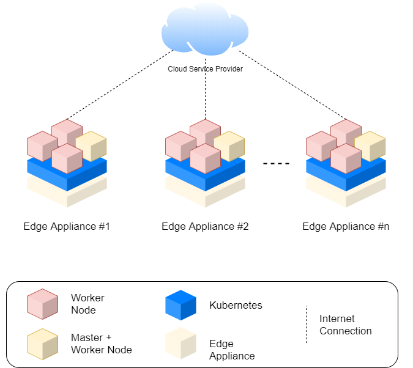

Edge Appliance Specification
============================

[TOC]

# Reference Hardware Design

## HW Block Diagram

With our hardware design, there are simple local clusters in the appliance, all device nodes are connected via Ethernet, and use internal gateway for internet access.

* Internal network connection linked with 1Gbps Ethernet
	- PoE switch enable PoE perhaps devices connectives, such as IP Camera, etc.
	- Static network topology inside the appliance
* OOBM Controller provide physical compute node control
	- Power/Reset/Recovery signal
	- Serial console access
	- Optional power wire control
* GPU Compute Node up to 24 nodes
	- Starts from minimal 3 nodes

### Reference Hardware

In our sample hardware, we choose NVIDIA [Jetson AGX Xavier](https://www.nvidia.com/zh-tw/autonomous-machines/jetson-agx-xavier/) and [Jetson TX2](https://www.nvidia.com/zh-tw/autonomous-machines/embedded-systems/jetson-tx2/) as our compute nodes. The reason for those chosen is we're looking for GPU enabled low-cost devices for both GPU related computing and general computing purpose. Developers are able to use any other hardware that meets all requirements for this software. This selection guideline are also applied for OOBM control board: [Raspberry Pi 4](https://www.raspberrypi.org/products/raspberry-pi-4-model-b/). Developers can change control board to any board that supports linux OS running plus ethernet & GPIO pins for compute node device control.

In this reference hardware design, we choose relay board for traditional electrical isolation, but we also recommend that any production-ready environment should use more reliable devices instead of relay, e.g., optronics relay or CMOS switch circuit.

# Software Architecture

Easy Configuration
Idea for Single Appliance & Multiple Appliances Federation use cases
Easy to integrated with Cloud Service Provider: Microsoft Azure, Google GCP, or Amazon AWS
Easy Deployment
Application deployment by Kubernetes ecosystem
Federation support for multiple appliances applications
Internal HA & Failover for applications

# Deployment

## Scalable Appliance Configuration

- Working like as standalone GPU enabled clusters
	- Suitable for microservices applications
- Configurable nodes for scalable application uses

## Cloud Service Integration

- Use appliance as edge devices, integrated with cloud providers for edge computing applications
	- Integrated with cloud management
	- Support multiple appliances deployment
	- Suitable for AI based edge use cases
